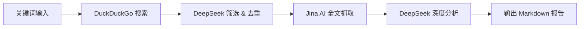
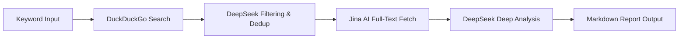

# 🧠 DeepDigest

> *From keyword to knowledge — AI-powered briefing generator.*

[中文](#中文版) | [English](#english-version)

---

<a name="中文版"></a>

## 🇨🇳 中文版


**DeepDigest** 是一个智能信息整合工具，它能够自动完成从**关键词搜索**到**深度分析报告**的全链路工作。它结合了 DuckDuckGo 搜索、Jina AI 全文抓取和 DeepSeek 大模型推理，将碎片化的网络信息转化为结构清晰、有洞察力的中文简报。

> 🚧 **开发状态：Alpha 预览版**  
> 核心流程已跑通，但部分配置项（如搜索数量、时间范围）目前为硬编码。欢迎体验并提交 Issue 反馈！

---

### ✨ 核心功能

- **🔍 智能搜索**：基于 DuckDuckGo 获取指定关键词的最新结果。
- **🧠 精准筛选**：利用 DeepSeek 对搜索结果进行相关性过滤、语义去重和情感分类（Positive/Neutral/Negative）。
- **📄 全文抓取**：通过 Jina AI Reader 提取高质量网页的纯文本内容（Markdown 格式），避开广告和干扰元素。
- **📊 深度报告**：由 DeepSeek 对多篇全文进行交叉分析，生成包含“单篇核心观点”、“交叉主题”和“综合研判”的结构化报告。
- **⚙️ 配置分离**：API 密钥与提示词模板独立存放，便于维护和自定义。

---

### 🗺️ 开发路线图

当前版本仅为概念验证（PoC），后续计划逐步优化：

- [ ] 支持命令行参数（`--keyword`, `--max-results`）替代硬编码
- [ ] 增加 `config.yaml` 全局配置文件
- [ ] 增加日志系统（`logging`）替代 `print`
- [ ] 优化 Jina 抓取性能（并发请求）
- [ ] 支持推送功能（飞书 / Telegram / Email）
- [ ] 增加缓存机制，避免重复抓取相同 URL

**欢迎认领任务或提出新想法！**

---

### 🚀 快速开始

#### 环境要求
- Python 3.8+
- `pip` 包管理器

#### 1. 克隆仓库
```bash
git clone https://github.com/sudo1123/DeepDigest.git
cd DeepDigest
```

#### 2. 安装依赖
```bash
pip install -r requirements.txt
```

#### 3. 配置密钥
在项目根目录下创建 `keys.json` 文件，填入你的 API 密钥（**请勿提交到公开仓库**）：
```json
{
    "keys": {
        "ds_api_key": "sk-你的DeepSeek_API密钥",
        "jina_api_key": "jina_你的Jina_API密钥"
    }
}
```

> **参考配置**：你可以复制 `keys.example.json`（需自行创建）并重命名为 `keys.json`。

#### 4. 运行
```bash
python main.py
```

程序将自动执行搜索、分析、抓取和报告生成流程，最终在终端输出 Markdown 格式的简报。

---

### 🏗️ 项目架构



---

### 📁 文件结构

```
DeepDigest/
├── main.py                 # 主流程控制
├── prompts.json            # 系统提示词模板（可自定义）
├── keys.json               # API 密钥（需自行创建，已忽略）
├── requirements.txt        # 依赖清单
├── LICENSE                 # GPL-3.0 许可证
└── README.md               # 项目说明
```

---

### 🛠️ 技术栈

- **[DeepSeek API](https://platform.deepseek.com/)**：核心推理引擎（筛选、摘要、分析）
- **[Jina AI Reader](https://jina.ai/reader/)**：网页内容清洗与提取
- **[DuckDuckGo Search (ddgs)](https://github.com/deedy5/ddgs)**：搜索源
- **[Requests](https://requests.readthedocs.io/)**：HTTP 请求交互

---

### 🤝 贡献指南

本项目秉承开源精神，欢迎任何形式的反馈与贡献！

- 发现 Bug 或有新想法？请提交 [Issue](https://github.com/sudo1123/DeepDigest/issues)
- 想参与开发？欢迎 Fork 并提交 Pull Request

> 提交 PR 前，请确保代码风格与现有模块保持一致，并尽可能添加简单的注释说明。

---

### 📄 许可证

All source code and configuration files in this repository are licensed under GPL-3.0, unless otherwise noted.

Copyright © 2026 sudo1123

本项目采用 **GNU General Public License v3.0** 许可证 – 详见 [LICENSE](LICENSE) 文件。

---

### 💡 温馨提示

目前 `main.py` 中的关键词（`keyword`）默认写死为 `"2026年6月16日"`，如需测试其他主题，请临时修改 `User_Input.get_keyword()` 方法中的返回值。后续版本将支持命令行参数传入。

[↑ 回到顶部](#deepdigest)

---

<a name="english-version"></a>

## 🇬🇧 English Version


**DeepDigest** is an intelligent information aggregation tool that automates the entire pipeline from keyword search to in-depth analytical reports. It combines DuckDuckGo search, Jina AI full-text extraction, and DeepSeek LLM reasoning to turn fragmented web data into well-structured, insightful Chinese-language briefings.

> 🚧 **Development Status: Alpha Preview**  
> The core workflow is functional, but some configurations (e.g., result count, time range) are currently hard-coded. Feel free to try it out and submit issues!

---

### ✨ Features

- **🔍 Smart Search** – Fetches the latest results from DuckDuckGo based on a given keyword.
- **🧠 Intelligent Filtering** – Uses DeepSeek to filter, deduplicate, and classify sentiment (Positive/Neutral/Negative) on search results.
- **📄 Full-Text Fetching** – Extracts clean, ad-free plain text (Markdown format) via Jina AI Reader.
- **📊 Deep Analysis** – Generates a structured report with "Core Insights per Article", "Cross-Cutting Themes", and "Overall Synthesis" using DeepSeek.
- **⚙️ Separation of Concerns** – API keys and prompt templates are stored separately for easy maintenance and customization.

---

### 🗺️ Roadmap

The current release is a proof-of-concept (PoC). Planned improvements include:

- [ ] Command-line argument support (`--keyword`, `--max-results`) to replace hard-coded values
- [ ] Global configuration via `config.yaml`
- [ ] Proper logging system (replace `print` with `logging`)
- [ ] Concurrent fetching for Jina AI (performance optimization)
- [ ] Push notifications (Feishu / Telegram / Email)
- [ ] Caching mechanism to avoid re-fetching the same URLs

**Contributions and feature requests are warmly welcomed!**

---

### 🚀 Getting Started

#### Prerequisites
- Python 3.8+
- `pip` package manager

#### 1. Clone the Repository
```bash
git clone https://github.com/sudo1123/DeepDigest.git
cd DeepDigest
```

#### 2. Install Dependencies
```bash
pip install -r requirements.txt
```

#### 3. Configure API Keys
Create a `keys.json` file in the project root with your API credentials (**do not commit this file**):
```json
{
    "keys": {
        "ds_api_key": "sk-your-deepseek-api-key",
        "jina_api_key": "jina-your-jina-api-key"
    }
}
```

> **Reference**: You can copy `keys.example.json` (if provided) and rename it to `keys.json`.

#### 4. Run the Program
```bash
python main.py
```

The program will automatically execute search, filtering, full-text fetching, and report generation, outputting a Markdown-formatted briefing to the terminal.

---

### 🏗️ Architecture



---

### 📁 File Structure

```
DeepDigest/
├── main.py                 # Main orchestration logic
├── prompts.json            # System prompt templates (customizable)
├── keys.json               # API keys (must be created locally, ignored by git)
├── requirements.txt        # Python dependencies
├── LICENSE                 # GPL-3.0 license
└── README.md               # Project documentation
```

---

### 🛠️ Tech Stack

- **[DeepSeek API](https://platform.deepseek.com/)** – Core reasoning engine (filtering, summarization, analysis)
- **[Jina AI Reader](https://jina.ai/reader/)** – Web content cleaning and extraction
- **[DuckDuckGo Search (ddgs)](https://github.com/deedy5/ddgs)** – Search source
- **[Requests](https://requests.readthedocs.io/)** – HTTP client

---

### 🤝 Contributing

This project embraces the spirit of open source. All forms of feedback and contributions are welcome!

- Found a bug or have a suggestion? Open an [Issue](https://github.com/sudo1123/DeepDigest/issues)
- Want to contribute code? Fork the repo and submit a Pull Request

> Before submitting a PR, please ensure your code style is consistent with existing modules and add brief comments where appropriate.

---

### 📄 License

All source code and configuration files in this repository are licensed under GPL-3.0, unless otherwise noted.

Copyright © 2026 sudo1123

This project is licensed under the **GNU General Public License v3.0** – see the [LICENSE](LICENSE) file for details.

---

### 💡 Note for Users

Currently, the keyword in `main.py` is hard-coded to `"2026年6月16日"` for demonstration. To test other topics, temporarily modify the return value in `User_Input.get_keyword()`. Support for command-line arguments will be added in future releases.

[↑ Back to top](#deepdigest)
